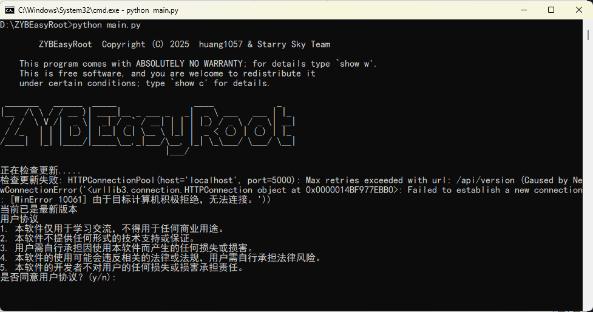

# ZYBEasyRoot

  
  <h1>ZYBEasyRoot</h1>
  
作业帮玩机工具箱

  

### 项目描述
* 本项目是一个作业帮玩机工具箱,包含了一些常用的工具,如root,解锁bootloader,提取boot镜像,修补boot镜像等。
* 本项目基于GPL V3.0协议发布,请严格遵守协议。

# 请TMD仔细看看各个机型的README!别在各种地方问那些**问题
### 各个机型的README
[T20](T20_README.md)
[T20Pro](T20Pro_README.md)

### 运行项目
* 请确保电脑系统版本为Windows10以上，安装Python3.9.x及以上版本。
* 如果您的电脑支持winget，则运行项目目录下run.bat即可
~~~
# 下载项目
git clone https://github.com/GHhuang1057/ZYBEasyRoot.git
cd ZYBEasyRoot
# 安装python依赖库
pip install -r requirements.txt
# 运行
python main.py
~~~

### 界面演示

### 目前所支持的机型：
| 机型 | 支持情况 |
| --- | --- |
| 作业帮T20 | 完整支持,但是尚未测试 |
| 作业帮T20 Pro | 暂时不支持 |
| 作业帮T20 Pro + | 暂时不支持 |
| 其他机型...... | 不支持,以后会支持 |

### 许可证声明  
**本项目严格遵循 [GNU通用公共许可证3.0（GPL V3.0）](https://www.gnu.org/licenses/gpl-3.0.en.html) 发布。**  

#### 您必须遵守的核心义务：  
1. **源代码提供**：  
   分发二进制产物时，必须同时提供完整的、可修改的源代码（通过下载链接或物理介质）。  
2. **协议传染性**：  
   基于本项目衍生的作品必须使用**相同的GPL V3.0协议**发布。  
3. **版权声明保留**：  
   不得删除原始版权声明和本许可证文档（[LICENSE](LICENSE)）。  

⚠️ **法律风险警示**：  
> 任何违反GPL V3.0的行为（如未提供源代码即售卖二进制文件）将导致：  
> - 自动丧失本许可证授予的权利；  
> - 可能面临著作权侵权诉讼；  
> - 迫使项目停止维护。  

---
#### 版权声明
~~~
Copyright (C) 2025  huang1057 & Starry Sky Team

This program is free software: you can redistribute it and/or modify
it under the terms of the GNU General Public License as published by
the Free Software Foundation, either version 3 of the License, or
(at your option) any later version.

This program is distributed in the hope that it will be useful,
but WITHOUT ANY WARRANTY; without even the implied warranty of
MERCHANTABILITY or FITNESS FOR A PARTICULAR PURPOSE.  See the
GNU General Public License for more details.

You should have received a copy of the GNU General Public License
along with this program.  If not, see <https://www.gnu.org/licenses/>.
~~~
---
### 协议文本  
- [GPL V3.0 英文原文](https://www.gnu.org/licenses/gpl-3.0.en.html)  
- [GPL V3.0 非官方中文译本](https://www.gnu.org/licenses/gpl-3.0.zh-cn.html)（仅供参考，法律效力以英文版为准）